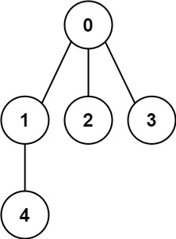

---
tags:
    - Depth-First Search
    - Breadth-First Search
    - Union Find
    - Graph
---

# [261. Graph Valid Tree](https://leetcode.com/problems/graph-valid-tree/)

You have a graph of `n` nodes labeled from `0` to `n - 1`. You are given an integer n and a list of `edges` where `edges[i] = [ai, bi]` indicates that there is an undirected edge between nodes `ai` and `bi` in the graph.

Return `true` *if the edges of the given graph make up a valid tree, and* `false` *otherwise*.

 

**Example 1:**



```
Input: n = 5, edges = [[0,1],[0,2],[0,3],[1,4]]
Output: true
```

**Example 2:**


```
Input: n = 5, edges = [[0,1],[1,2],[2,3],[1,3],[1,4]]
Output: false
```

 

**Constraints:**

- `1 <= n <= 2000`
- `0 <= edges.length <= 5000`
- `edges[i].length == 2`
- `0 <= ai, bi < n`
- `ai != bi`
- There are no self-loops or repeated edges.


**Solution:**

```java
class Solution {
    public boolean validTree(int n, int[][] edges) {
        List<List<Integer>> adj = new ArrayList<List<Integer>>();

        for (int i = 0; i < n; i++){
            adj.add(new ArrayList<Integer>());
        }
        // [1,2,3] [0,4] [0] [0] [1] 

        for (int[] edge : edges){
            adj.get(edge[0]).add(edge[1]);
            adj.get(edge[1]).add(edge[0]);
        }

        boolean[] visited = new boolean[n];
        //  0 1 2 3 4 
        //  T T T T T
        int index = 0;
        int parent = -1;
        if (dfs(index, visited, adj, parent)){ // wether has cycle
            return false;
        }

        for (int i = 0; i < n; i++){
            if (visited[i] == false){
                return false;
            }

        }

        return true;

    }


    private boolean dfs(int node, boolean[] visited, List<List<Integer>> adj, int parent){
        if (visited[node] == true){
            return true;
        }

        visited[node] = true;

        for (int next : adj.get(node)){
            if (parent != next && dfs(next, visited, adj, node)){
                return true;
            }
        }

        return false;
    }
}

// TC: O(n)
// SC: O(n)
```

