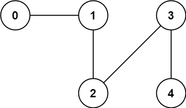

# [323. Number of Connected Components in an Undirected Graph](https://leetcode.com/problems/number-of-connected-components-in-an-undirected-graph/)

You have a graph of `n` nodes. You are given an integer `n` and an array `edges` where `edges[i] = [ai, bi]` indicates that there is an edge between `ai` and `bi` in the graph.

Return *the number of connected components in the graph*.

 

**Example 1:**


```
Input: n = 5, edges = [[0,1],[1,2],[3,4]]
Output: 2
```

**Example 2:**



```
Input: n = 5, edges = [[0,1],[1,2],[2,3],[3,4]]
Output: 1
```

 

**Constraints:**

- `1 <= n <= 2000`
- `1 <= edges.length <= 5000`
- `edges[i].length == 2`
- `0 <= ai <= bi < n`
- `ai != bi`
- There are no repeated edges.


**Solution:**

```java
class Solution {
    int components = 0;
    public int countComponents(int n, int[][] edges) {
        boolean[] visited = new boolean[n];

        List<List<Integer>> adj = new ArrayList<List<Integer>>();

        for (int i = 0; i < n; i++){
            adj.add(new ArrayList<Integer>());
        }

        for (int[] edge : edges){
            adj.get(edge[0]).add(edge[1]);
            adj.get(edge[1]).add(edge[0]);
        }

        for (int i = 0; i < n; i++){
            if (visited[i] == false){
                dfs(i, visited, adj);
                components++;
            }

        }

        return components;
    }

    private void dfs(int index, boolean[] visited, List<List<Integer>> adj){
        visited[index] = true;

        for (int next : adj.get(index)){
            if (visited[next] == false){
                dfs(next, visited, adj);
            }

        }
        return;
    }
}

// TC: O(V+E)
// SC: O(E)
```

